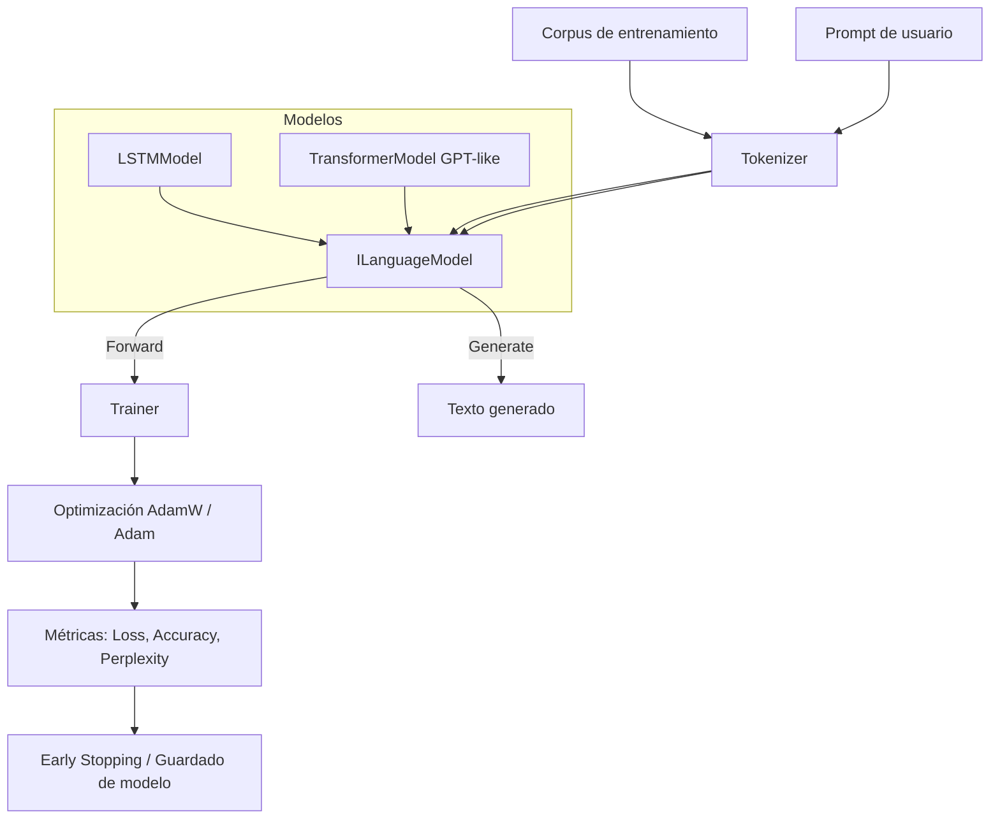

# 📘 MoNeriSharp

MoNeriSharp es un framework en **C# + TorchSharp** para experimentar con **modelos de lenguaje** (LSTM y Transformer GPT‑like).  
Su objetivo es ofrecer una base clara y extensible para entrenar, validar y generar texto con arquitecturas modernas.

---

## 🚀 Características principales

- **Interfaz común `ILanguageModel`**  
  - `Forward(tokens, mask = null)` → unifica LSTM y Transformer.  
  - `Generate(prompt, tokenizer, …)` → generación autoregresiva.  

- **Modelos disponibles**  
  - `LSTMModel`: arquitectura recurrente clásica con embeddings, LSTM y capa final.  
  - `TransformerModel`: arquitectura GPT‑like con:
    - Máscara causal (autoregresiva).  
    - Positional embeddings aprendibles.  
    - Bloques `TransformerBlock` con pre‑LayerNorm, residual connections y feed‑forward con GELU.  
    - Normalización final antes de la proyección al vocabulario.  

- **Entrenadores**  
  - `LSTMTrainer`: entrenamiento estándar con early stopping.  
  - `TransformerTrainer`: entrenamiento autoregresivo con AdamW, métricas de precisión y perplexity, early stopping.  

- **Tokenizador modular**  
  - Limpieza de texto (`WordCleaner`).  
  - Construcción de vocabulario (`VocabularyBuilder`).  
  - Codificación y decodificación de secuencias.  

---

## 📂 Estructura del proyecto

```

MoNeriSharp/ ├── src/ │ ├── modules/ │ │ ├── ILanguageModel.cs │ │ ├── LSTMModel.cs │ │ ├── TransformerModel.cs │ │ └── TransformerBlock.cs │ ├── training/ │ │ ├── LSTMTrainer.cs │ │ └── TransformerTrainer.cs │ └── utils/ │ ├── Tokenizer.cs │ ├── WordCleaner.cs │ └── VocabularyBuilder.cs ├── models/ # Carpeta donde se guardan modelos entrenados y métricas └── README.md

````

---

## ⚙️ Ejemplo de uso

### Entrenar un Transformer GPT‑like
```csharp
var tokenizer = new Tokenizer(vocab);
var model = new TransformerModel(
    name: "gpt-mini",
    vocabSize: tokenizer.VocabSize,
    embedDim: 256,
    numHeads: 8,
    numLayers: 6,
    maxSeqLen: 512
);

TransformerTrainer.Train(
    model,
    trainCorpus,
    valCorpus,
    tokenizer,
    epochs: 20,
    batchSize: 32,
    maxLenHint: 128,
    lr: 0.0005,
    patience: 3,
    modelFileName: "gpt-mini.pt"
);
````

### Generar texto

```csharp
string prompt = "Había una vez en Saltillo";
string output = model.Generate(prompt, tokenizer, maxLen: 50);
Console.WriteLine(output);
```

---

## 📊 Métricas

- **Loss promedio por epoch** (train/val).
- **Accuracy de tokens**.
- **Perplexity** (criterio de early stopping).
- Exportación automática a `training_metrics.csv`.

---

## 📊 Flujo de entrenamiento y generación



---

## 🛠️ Roadmap

- [x] LSTM básico con generación.
- [x] Transformer GPT‑like con causal masking.
- [x] Interfaz común `ILanguageModel`.
- [ ] Scheduler de learning rate (warmup + cosine decay).
- [ ] Dataset más grande y benchmarks de calidad.
- [ ] Integración multimodal (texto + voz).

---

## 📜 Licencia

Proyecto educativo y experimental. Uso libre para investigación y aprendizaje.
Nada comercial