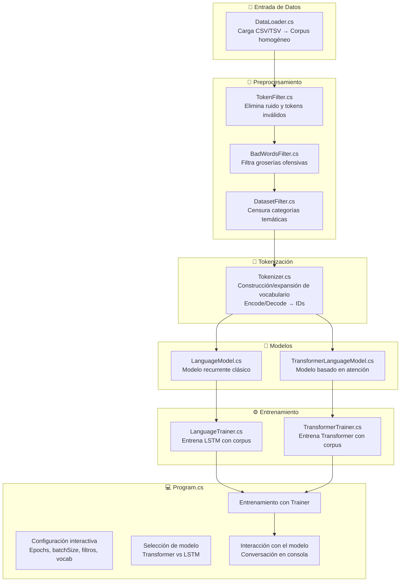

---

## 📌 Explicación del flujo

1. **Entrada de datos:**
    
    - `DataLoader` detecta columnas relevantes en CSV/TSV y construye corpus homogéneo con roles (`[USER]`, `[ASSISTANT]`, `<QUESTION>`, `<ANSWER>`).
2. **Preprocesamiento:**
    
    - `TokenFilter` elimina ruido y tokens inválidos.
    - `BadWordsFilter` filtra groserías (opcional).
    - `DatasetFilter` censura categorías temáticas.
3. **Tokenización:**
    
    - `Tokenizer` construye o expande vocabulario.
    - Convierte texto → IDs (`Encode`) y IDs → texto (`Decode`).
4. **Modelos:**
    
    - `LanguageModel` (LSTM).
    - `TransformerLanguageModel` (más potente en secuencias largas).
5. **Entrenamiento:**
    
    - `LanguageTrainer` o `TransformerTrainer` entrenan el modelo elegido.
    - Incluyen validación, early stopping, checkpoints y métricas (`Loss`, `Perplexity`).
6. **Aplicación (`Program.cs`):**
    
    - Configuración interactiva de hiperparámetros.
    - Selección de modelo.
    - Entrenamiento.
    - Interacción en consola con el modelo entrenado.
    - Guardado final del checkpoint.